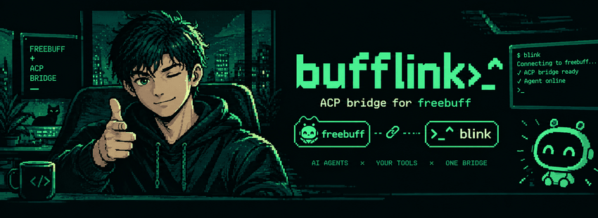

<h1> BuffLINK</h1>

An [Agent Client Protocol](https://agentclientprotocol.com) bridge for the free
[freebuff](https://freebuff.com/cli) coding agent.

<p align="center">
  
</p>

`blink` is an ACP *agent*: it speaks the protocol on stdio and, behind it,
drives freebuff's interactive TUI in a pseudo-terminal — exactly the way a
person would. Any ACP client — an editor, an orchestrator, a chat front-end —
can register it like any other agent and use freebuff without knowing a TUI
is involved.

[](https://www.rust-lang.org/)
[](https://github.com/jmvbambico/bufflink/actions/workflows/tests.yml)
[](https://github.com/jmvbambico/bufflink/releases)
[](LICENSE)

```
cargo install --path .     # puts `blink` on PATH
```

Then register `blink` wherever your client lists ACP agents. The agent takes
no arguments and needs no environment beyond what freebuff itself needs
(`freebuff` on PATH, logged in). Two examples:

```jsonc
// Zed — settings.json
"agent_servers": {
  "Freebuff": { "command": "blink" }
}
```

```yaml
# Omnigent — ~/.omnigent/config.yaml
acp:
  agents:
    - { name: Freebuff, command: blink, omnigent_mcp: false, inject_system_prompt: false }
```

The client launches `blink`; `blink` launches freebuff on the first
`session/new`, types your prompt into it, and streams the reply back over
`session/update`. Anything that can spawn a process and speak newline-delimited
JSON-RPC over its stdio can drive it — the protocol is the whole interface.

---

## Why this exists

freebuff has no headless or JSON mode
([CodebuffAI/freebuff#947](https://github.com/CodebuffAI/freebuff/issues/947)),
so nothing can script it — but every serious agent host speaks ACP. bufflink is
the missing adapter, built on three rules:

- **Drive the official CLI as a user would.** The bridge types into freebuff's
  TUI and reads what freebuff itself writes. It never talks to freebuff's
  backend, never reuses its credentials, never skips an ad or interstitial.
- **Never touch freebuff state you did not create.** `~/.config/manicode` is
  read-only to the bridge except through the freebuff process.
- **Fail loudly.** If the TUI changes shape, you get a clear ACP error — never
  an empty or fabricated reply.

## How it works

```
ACP client ──stdio JSON-RPC──▶ blink ──PTY──▶ freebuff (TUI)
                                 │                 │
                                 └── watches ──▶ ~/.config/manicode/projects/<cwd>/chats/<id>/
                                                  chat-messages.json  ·  log.jsonl
```

| ACP | what blink does |
|---|---|
| `initialize` | answers protocol v1; spawns nothing |
| `session/new` | launches `freebuff --cwd <cwd>` in a 120×40 PTY, accepts the model splash, waits for the idle prompt |
| `session/prompt` | bracketed-pastes the text, presses Enter, then polls freebuff's own transcript and log; reasoning → `agent_thought_chunk`, reply → `agent_message_chunk`, tools → `tool_call` / `tool_call_update` |
| `session/cancel` | presses Esc; the prompt returns `stopReason: cancelled` |
| stdin EOF / SIGTERM | types `/exit`, then signals freebuff's whole process group |

The PTY only *drives* the TUI. Reply text comes from `chat-messages.json` and
the `Main prompt finished` line in `log.jsonl` — no screen-scraping of model
output. All knowledge of what the TUI looks like lives in `src/freebuff/`, so
a freebuff UI change is a one-module fix.

## Things to know

- **One `blink` = one freebuff = one chat.** Every launch costs 5 of the free
  tier's 25 daily Freebucks (one paid hour), so the process is kept alive
  across prompts and the e2e test launches it exactly once.
- **No approval gate.** This freebuff build runs commands and edits files
  without asking. `blink` reports every tool call but cannot block one.
- **Replies arrive at turn end.** freebuff writes its transcript once, when
  the turn finishes, so nothing streams while it thinks. If your client has
  an idle/inactivity timeout on prompts, raise it for long tasks.
- **Stop states are surfaced, never bypassed:** out of Freebucks, another
  freebuff already running (`blink` never chooses *Take over*), kicked out.
  Each comes back as a JSON-RPC error with a plain-language message.
- **Protocol surface, deliberately minimal:** `initialize` (v1),
  `session/new`, `session/prompt`, `session/cancel`, and `session/update`
  notifications (`agent_thought_chunk`, `agent_message_chunk`, `tool_call`,
  `tool_call_update`). No `session/load`, no permission requests (freebuff
  has nothing to gate), no MCP passthrough — `mcpServers` is accepted and
  ignored.

Environment: `BLINK_FREEBUFF_BIN` (default `freebuff`),
`BLINK_TURN_TIMEOUT_S` (900), `BLINK_SETTLE_TIMEOUT_S` (5),
`BLINK_MANICODE_DIR` (`~/.config/manicode`), `RUST_LOG` (logs go to stderr;
stdout is JSON-RPC only).

`BLINK_MODEL` pins the model picked on freebuff's splash: a name or id
fragment (`deepseek/deepseek-v4.1-flash`, `glm-5.3-flash`, `mimo-2.5`),
matched case-insensitively against the splash's display names. Unset means
freebuff's default (Enter on the collapsed splash). The lineup rotates, so
match on the name you saw, not an id; a name that matches nothing — or
several rows — fails loudly instead of starting the wrong hour. A previous
 hard kill leaves a `Session ended` resume screen on the next launch;
`blink` sends Esc there for a fresh splash and never resumes blindly. If an
hour is already running, freebuff skips the splash and resumes on that
hour's model, so on reaching Idle `blink` re-checks the status row against
`BLINK_MODEL` and fails loudly on a mismatch instead of running the wrong
hour.

## Development

```
cargo fmt --all -- --check
cargo clippy --all-targets -- -D warnings
cargo test --lib --bins                                   # 90 unit tests, no freebuff needed
BUFFLINK_E2E=1 cargo test --test e2e -- --ignored         # ONE real freebuff launch
```

Unit tests drive an offline `fake-freebuff.sh` that reproduces the real
screens and files (captured in `docs/research/`). The e2e test does the whole
lifecycle in one launch: PONG → cancel mid-turn → PING → clean exit → no
leaked process. `AGENTS.md` is the constitution for anyone — human or agent —
working on the code; `docs/research/` holds what we know about freebuff's TUI
and the ACP contract.

Dependencies, all justified in `Cargo.toml`: tokio, serde, serde_json,
anyhow, pty-process, vt100, tracing, tracing-subscriber, libc. 76 crates total.

## Status

v0.1 — working end to end on freebuff 0.0.172 / macOS. Known gaps: `/exit`
is not honoured from the bridge (shutdown falls back to a process-group
signal); no live streaming during a turn; Linux untested against the real
binary.
